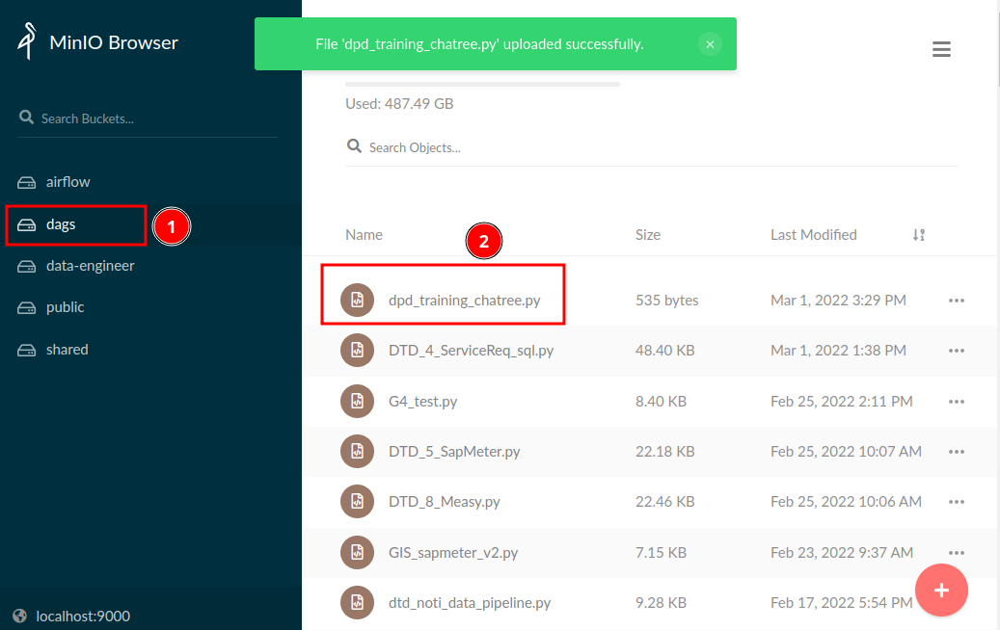
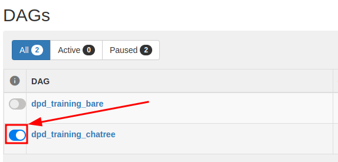
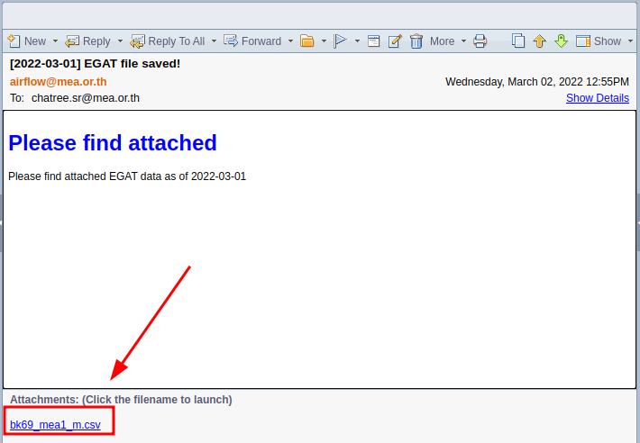

# Basics

## Prerequisites

ทักษะพื้นฐานที่ควรมี

- Python 3.6+
- Basic Apache Airflow
- Basic databases
- Linux

## Airflow Architecture


### จุดสำคัญ

- Airflow อ่าน DAGs จาก Bucket ชื่อ `dags` ใน MinIO มีการซิงค์ข้อมูลทุกๆ 1 นาที
- Airflow เชื่อมต่อกับ Data Platform Services หลังบ้าน เช่น Hive, Impala, HBase, Spark
- Airflow เชื่อมต่อกับฐานข้อมูลใน MEA บางส่วน เช่น SAP SFTP, AMR Oracle Database, OT MSSQL Database, etc.
- Airflow ใช้งาน Docker และติดตั้งแบบ Celery Executor มี 15 Workers
- Airflow Server มี 92 vCPUs และ 312 GB RAM

### กระบวนงานพื้นฐาน

1. เขียน DAGs ด้วยภาษา Python
2. Log in เข้าใช้งาน [MinIO Server](http://172.17.113.251:9000) และให้อัพโหลดไฟล์ `.py` เข้าไปที่ Bucket ชื่อ `dags`.
3. ถ้าไม่มีข้อผิดพลาด Airflow จะทำการซิงค์ DAGs ภายใน 2 - 3 นาที ถ้ามีความผิดพลาดหน้าต่าง UI จะแจ้ง
4. เข้าไปตรวจสอบและบริหารจัดการ DAGs ได้ที่ [Airflow Web UI](http://airflow.mea.or.th:8080).

## Example 1 - Simple DAG

### Create DAGs

Copy code ด้านล่างและเซฟเป็นชื่อ `dpd_training_<name>.py`

```py title="dpd_training_chatree.py" linenums="1"
import airflow
from airflow import DAG
from airflow.operators.dummy import DummyOperator


# Initialize the DAG
with DAG(
    dag_id="dpd_training_chatree",
    description="DAG for learning Apache Airflow",
    start_date=airflow.utils.dates.days_ago(1),
    schedule_interval="@daily"
) as dag:

    task1 = DummyOperator(task_id="task1")
    task2 = DummyOperator(task_id="task2")
    task3 = DummyOperator(task_id="task3")
    task4 = DummyOperator(task_id="task4")

    task1 >> task2 >> task3 >> task4
```

จุดสำคัญ

- **Line 8**: DAG ID ต้อง**ไม่ซ้ำกัน** (Globally unique)
- **Line 10**: `start_date` คือวันที่ต้องการให้ DAG เริ่มทำงาน ใช้ `datetime` หรือ `airflow.utils.dates` ก็ได้
- **Line 11**: `schedule_interval` คือรอบการรัน DAG เช่น `@daily` คือ ให้รันรายวัน, `@monthly` คือรันรายเดือน

### Objective

ต้องการสร้าง DAG ที่รันได้ แต่ไม่มีฟังก์ชั่นใดๆ

### Deploy DAGs

เปิดเว็บไซต์ของ MinIO ที่ [http://172.17.113.251:9000](http://172.17.113.251:9000) และเลือกที่ Bucket `dags` จากนั้นลากไฟล์ `dpd_training_<name>.py` บนเครื่องไปใส่ใน `dags`



### Manage DAGs

เปิดเว็บไซต์ Airflow UI ที่ [http://airflow.mea.or.th](http://airflow.mea.or.th) รอประมาณ 2 - 3 นาที แล้วลองค้นหา DAG ด้วยชื่อ `dpd_training` จะเห็น DAG ที่อัพโหลดเข้าไป บริหารจัดการ เปิดปิด DAG ได้เลย


### Results

กด Switch ข้างซ้ายเพื่อเปิดการทำงานของ DAG และ ดูผลลัพธ์




## Example 2 - Read from MinIO

ถ้าต้องการนำไฟล์พวก CSV, JSON หรือ อื่นๆ เข้าไปประมวลผลใน Airflow ขั้นตอนคือ

1. อัพโหลดไฟล์ใน Bucket ชื่อ `airflow` (เฉพาะ Data Engineer) หรือ `public` (เห็นได้ทุกคน)
2. เขียน DAG ให้ดาวโหลดไฟล์จาก MinIO
3. Deploy DAG บน MinIO Bucket `dags`
4. บริหารจัดการ DAG บน Airflow UI

### Objective

ต้องการสร้าง DAG ที่ดาวโหลดข้อมูลจาก MinIO และส่งไฟล์ที่ดาวโหลดเข้าอีเมลล์พนักงาน กฟน.

### Upload files

เอาไฟล์ที่ต้องการโยนเข้าไปใน `airflow` Bucket


### Create DAG

Copy code ด้านล่างใส่ไฟล์ชื่อ `dpd_training_minio_<name>.py` ถ้าต้องการศึกษาเพิ่มเติมดูที่

- [ตัวอย่างโดยละเอียดอ่านที่ ตัวอย่างการอ่านไฟล์ CSV จาก MinIO](https://dataplatform-portal.vercel.app/docs/use/minio#%E0%B8%94%E0%B8%B2%E0%B8%A7%E0%B9%82%E0%B8%AB%E0%B8%A5%E0%B8%94%E0%B9%84%E0%B8%9F%E0%B8%A5%E0%B9%8C)
- [MinIO Python SDK](https://docs.min.io/docs/python-client-api-reference.html)

```py title="dpd_training_minio_chatree.py" linenums="1"
import airflow
import urllib3
from minio import Minio
from airflow import DAG
from airflow.models import Variable
from airflow.operators.email import EmailOperator
from airflow.operators.python import PythonOperator


# Initialize the DAG
with DAG(
    dag_id="dpd_training_minio_chatree",
    description="Download file from MinIO to Airflow Cluster",
    start_date=airflow.utils.dates.days_ago(1),
    schedule_interval="@daily"
) as dag:

    # define python function to be used with PythonOperator
    def _read_file_from_minio(obj, bucket, out):
        client = Minio(
            Variable.get('MINIO_HOST'),
            access_key=Variable.get('MINIO_SECRET_ACCESS_KEY'),
            secret_key=Variable.get('MINIO_SECRET_KEY'),
            secure=False,
            http_client=urllib3.ProxyManager('http://meaproxy.mea.or.th:80')
        )

        client.fget_object(
            bucket_name=bucket,
            object_name=obj,
            file_path=out
        )


    download_file = PythonOperator(
        task_id="download_file",
        python_callable=_read_file_from_minio,
        op_kwargs={
            "obj": 'DPD/crash_catalonia.csv',
            "bucket": 'airflow',
            "out": '/shared/crash_catalonia.csv'
        }
    )

    send_file = EmailOperator(
        task_id="send_file",
        to=["chatree.sr@mea.or.th"],
        subject="[{{ ds }}] File downloaded from MinIO",
        html_content="""
        <p>Please find attached</p>
        """,
        files=["/shared/crash_catalonia.csv"]
    )

    download_file >> send_file

```

จุดสำคัญ

- **Line 5**: ประกาศตัวแปรที่ไม่ต้องการเปิดเผยค่า เช่น Password, Key ผ่านหน้าต่าง Airflow UI > Admin > Variables
- **Line 6-7**: Operator คือ Code ที่มีคนเขียนมาให้ ใช้แก้ปัญหาเฉพาะจุด เช่น `EmailOperator` ใช้ส่ง Email, `PythonOperator` ใช้รันโปรแกรม Python
- **Line 19-25**: เขียน Function ใช้อ้างถึงตอนใช้งาน `PythonOperator` ตัว MinIO จะต้องใช้ `http_client=urllib3.ProxyManager` ด้วยเนื่องจาก Network กฟน. ต้องผ่าน Proxy
- **Line 38**: Pass arguments ไปที่ `python_callable` ด้วย `op_kwargs={}`
- **Line 41**: Airflow มี Workers 15 ตัว แต่ละตัวมี File System ของตัวเอง สาเหตุที่ต้องใช้ Path `/shared` เพราะว่าเป็น Shared Path เดียวที่ Worker ทุกตัวเข้าถึงได้
- **Line 45**: ส่งเมลล์พร้อมแนบไฟล์ได้เลย ไม่ต้อง Config SMTP (เพราะตั้งค่าหลังบ้านไว้หมดแล้ว)
- **Line 47**: เปลี่ยนเป็น Email ของตัวเอง เพื่อตรวจสอบผลลัพธ์
- **Line 48**: `{{ ds }}` คือ Jinja Template ที่ Airflow ใช้แทนค่าตัวแปรต่างๆ เช่น `ds` คือ Dag Run Date ตัวอย่างอื่นๆดูที่ [Template Reference](https://airflow.apache.org/docs/apache-airflow/stable/templates-ref.html)

### Deploy DAG

เปิดเว็บไซต์ของ MinIO ที่ [http://172.17.113.251:9000](http://172.17.113.251:9000) และเลือกที่ Bucket `dags` จากนั้นลากไฟล์ `dpd_training_minio_<name>.py` บนเครื่องไปใส่ใน `dags`

### Manage DAG

เปิดเว็บไซต์ Airflow UI ที่ [http://airflow.mea.or.th](http://airflow.mea.or.th) รอประมาณ 2 - 3 นาที แล้วลองค้นหา DAG ด้วยชื่อ `dpd_training` จะเห็น DAG ที่อัพโหลดเข้าไป บริหารจัดการ เปิดปิด DAG ได้เลย

### Results

- เช็คหน้าต่าง UI จะเห็นว่า Task รันเสร็จหมดแล้ว
- เช็คอีเมลล์ของตัวเอง ดูไฟล์ที่ส่งออกมาจาก Airflow


## Example 3 - Pandas & REST API

ตังแต่ตัวอย่างนี้เป็นต้นไปจะไม่แสดงวิธีการ Deploy และ Manage DAG

### Objective

ต้องการสร้าง DAG ที่

1. ดึงข้อมูลจาก EGAT API
2. ประมวลผลด้วย Pandas
3. บันทึกไฟล์เพื่อ Backup บน MinIO
4. จัดเก็บข้อมูลใน Hive
5. ส่งเมลล์พร้อมไฟล์แนบให้หน่วยงานที่เกี่ยวข้อง

### Create DAG

```py title="dpd_training_egat_chatree.py" linenums="1"
import airflow
import json
import urllib3
import requests
import numpy as np
import pandas as pd
from minio import Minio
from airflow import DAG
from airflow.models import Variable
from airflow.operators.email import EmailOperator
from airflow.operators.python import PythonOperator
from airflow.providers.jdbc.operators.jdbc import JdbcOperator

# Custom MEA hooks
from mea.hooks.webhdfs import WebHDFSHook

# Initialize the DAG
with DAG(
    dag_id="dpd_training_minio_egat_chatree",
    description="Store data from EGAT API to Data Platform ",
    start_date=airflow.utils.dates.days_ago(1),
    template_searchpath=["/shared"],
    schedule_interval="@daily"
) as dag:

    ###############################################################################
    #               Utility functions; Should be in a separate file.              #
    ###############################################################################
    def _get_token():
        headers = {
            'Content-Type': 'application/json'
        }

        data = {
            "username": Variable.get('DPD_EGAT_API_ACCESS_KEY'),
            "password": Variable.get('DPD_EGAT_API_SECRET_KEY')
        }

        try:
            res = requests.post(
                Variable.get('DPD_EGAT_API_AUTH_URL'),
                headers=headers,
                json=data
            )
            res.raise_for_status()
        except requests.exceptions.HTTPError as e:
            raise SystemExit(e)

        return res.json().get('access_token')

    def _get_data(api_url, feeder_name, year, month, outfile):
        token = _get_token()

        headers = {
            "Content-Type": "application/json",
            "Authorization": f"Bearer {token}"
        }

        data = {
            "linefeederName": feeder_name,
            "year": year,
            "month": month
        }

        try:
            res = requests.post(
                Variable.get(api_url),
                headers=headers,
                json=data
            )
        except requests.exceptions.HTTPError as e:
            raise SystemExit(e)

        with open(outfile, 'w') as f:
            json.dump(res.json(), f)

    def _get_billing(feeder_name, year, month, outfile):
        _get_data('DPD_EGAT_API_BILLING_URL', feeder_name, year, month, outfile)

    def _get_lp(feeder_name, year, month, outfile):
        _get_data('DPD_EGAT_API_LP_URL', feeder_name, year, month, outfile)

    def _convert_json_to_csv(infile, outfile):
        with open(infile, 'r') as f:
            records = json.load(f)

        # Convert JSON to DataFrame and save to CSV
        pd.DataFrame.from_records(records).to_csv(outfile, index=False)

    def _generate_hive_sql(infile, outfile, db_name, table_name, hdfs_path):
        df = pd.read_csv(infile)

        with open(outfile, 'w') as f:
            f.write(f'CREATE EXTERNAL TABLE IF NOT EXISTS {db_name}.{table_name}(\n')
            for col in df.columns:
                if df[col].dtype == object:
                    f.write(f'\t{col} STRING')

                if df[col].dtype == np.int64:
                    f.write(f'\t{col} DOUBLE')

                if df[col].dtype == np.float64:
                    f.write(f'\t{col} DOUBLE')

                if col != df.columns[-1]:
                    f.write(',\n')

            f.write(')\n')
            f.write('ROW FORMAT DELIMITED\n')
            f.write("FIELDS TERMINATED BY ','\n")
            f.write('STORED AS TEXTFILE\n')
            f.write(f"LOCATION '{hdfs_path}'\n")
            f.write("TBLPROPERTIES ('skip.header.line.count'='1');")

    def _upload_file_to_hdfs(infile, hdfs_path):
        hdfs = WebHDFSHook(webhdfs_conn_id='sys-hdfs')
        hdfs.load_file(
            source=infile,
            destination=hdfs_path,
            overwrite=True
        )

    def _upload_file_to_minio(obj, bucket, file_path):
        client = Minio(
            Variable.get('MINIO_HOST'),
            access_key=Variable.get('MINIO_SECRET_ACCESS_KEY'),
            secret_key=Variable.get('MINIO_SECRET_KEY'),
            secure=False,
            http_client=urllib3.ProxyManager('http://meaproxy.mea.or.th:80')
        )

        client.fput_object(
            bucket_name=bucket,
            object_name=obj,
            file_path=file_path
        )


    ###############################################################################
    #                                    Tasks                                    #
    ###############################################################################
    get_egat_lp = PythonOperator(
        task_id="get_egat_lp",
        python_callable=_get_lp,
        op_kwargs={
            "feeder_name": "BK/69 MEA#1 M",
            "year": 2021,
            "month": 12,
            "outfile": "/shared/bk69_mea1_m.json"
        }
    )

    convert_json_to_csv = PythonOperator(
        task_id="convert_json_to_csv",
        python_callable=_convert_json_to_csv,
        op_kwargs={
            "infile": "/shared/bk69_mea1_m.json",
            "outfile": "/shared/bk69_mea1_m.csv"
        }
    )

    upload_file_to_hdfs = PythonOperator(
        task_id="upload_file_to_hdfs",
        python_callable=_upload_file_to_hdfs,
        op_kwargs={
            "infile": '/shared/bk69_mea1_m.csv',
            "hdfs_path": '/user/airflow/dpd-training/egat/bk69_mea1_m.csv'
        }
    )

    upload_backup_to_minio = PythonOperator(
        task_id="upload_backup_to_minio",
        python_callable=_upload_file_to_minio,
        op_kwargs={
            'bucket': 'airflow',
            'obj': 'DPD/bk69_mea1_m.csv',
            'file_path': '/shared/bk69_mea1_m.csv'
        }
    )

    generate_hive_sql = PythonOperator(
        task_id="generate_hive_sql",
        python_callable=_generate_hive_sql,
        op_kwargs={
            "infile": '/shared/bk69_mea1_m.csv',
            "outfile": '/shared/bk69_mea1_m.sql',
            "db_name": 'airflow',
            "table_name": 'dpd_training_egat_chatree',
            "hdfs_path": '/user/airflow/dpd-training/egat/'
        }
    )

    create_external_table = JdbcOperator(
        task_id="create_external_table",
        jdbc_conn_id='sys-jdbc-hive',
        sql="bk69_mea1_m.sql"
    )

    send_email = EmailOperator(
        task_id="send_email",
        to=["chatree.sr@mea.or.th"],
        subject="[{{ ds }}] EGAT file saved!",
        html_content="""
        <h1 style="color: blue;">Please find attached</h1>
        <p>Please find attached EGAT data as of {{ ds }}</p>
        """,
        files=["/shared/bk69_mea1_m.csv"]
    )


    get_egat_lp >> convert_json_to_csv >> upload_file_to_hdfs >> generate_hive_sql >> create_external_table >> send_email
    convert_json_to_csv >> upload_backup_to_minio >> send_email

```

จุดสำคัญ

- อะไรที่ทำบน Python ได้ ทำบน Airflow ได้เหมือนกัน
- ส่วนใหญ่จะมี Operator เฉพาะกิจไว้ให้แล้ว ตรวจสอบรายการได้ที่ [Airflow Operators & Hooks](https://airflow.apache.org/docs/apache-airflow-providers/operators-and-hooks-ref/index.html)
- ฝวท. พัฒนา Custom Hooks & Operators บางส่วนเพื่อให้สามารถเชื่อมต่อ Data Platform ได้ เช่น `mea.hooks.webhdfs`

### Results





