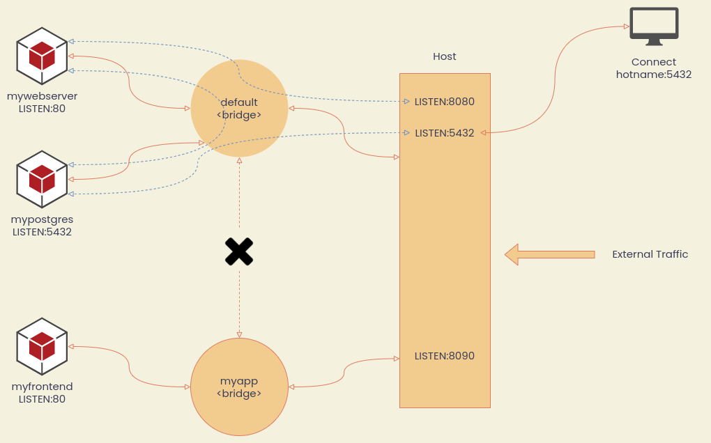

# Networks

Network คือ ระบบสื่อสารของ Container ถ้าไม่ได้ระบุ Docker Engine จะให้ Container อยู่ที่ Default Bridge Network โดยอัตโนมัติ คำสั่งที่ใช้บริหารจัดการคือ `network` เช่น

```bash
docker network <sub-command> [options]
```

โดยปกติเรามักจะจับกลุ่มให้ Application เดียวกันอยู่ภายใต้ Network เดียวกัน

## Concept



## List Networks

```bash
docker network ls
```

## Check Containers in Networks

```bash
docker network inspect <network_id>
```

ดูที่ Section Containers จะเห็นว่า Container ไหนอยู่ใน Network ใด

## Create a Network

```bash
docker network create <network_name>
```

- Default Network Driver จะเป็น Bridge ในอนาคตเราจะมีการใช้งาน Docker Swarm ซึ่งใช้ Overlay Network
- Network ที่สร้างขึ้นมาเองจะมี DNS Resolver ให้อัตโนมัติ หมายความว่าสามารถใช้ชื่อ Container แทน IP Address ได้เลย (**Default Network ไม่มี DNS Resolver ให้**)

## Example 1 - Database Dev

สมมติว่าต้องการสร้าง Development Environment สำหรับทดลองใช้งาน Database

- มีหน้าเว็บ UI
- มีฐานข้อมูล PostgreSQL

### Create a Database Network

เริ่มด้วยการสร้าง Network

```bash
docker network create db-dev
```

### Run a Web UI within Network

รัน Cloudbeaver UI (ตัวบริหารจัดการ Database บน Web) ด้วย `--network`

```bash
docker run \
    --name cloudbeaver \
    -d -it -p 8090:8978 \
    --network db-dev \
    dbeaver/cloudbeaver:latest
```

### Run a PostgreSQL within Network

เหมือนด้านบน

```bash
docker container run \
    --name mypostgres \
    -d -p 5432:5432 \
    -e POSTGRES_PASSWORD=secretpassword \
    -v postgresdb:/var/lib/postgresql/data \
    --network db-dev \
    postgres
```

### Check

ตรวจสอบโดยการเข้าเว็บ [http://localhost:8090](http://localhost:8090) โดยเวลาระบุ hostname ให้ระบุชื่อ Container `mypostgres` ได้เลยเนื่องจาก Docker Engine จะทำการแปล `mypostgres` เป็น IP Address ให้อัตโนมัติ

## Example 2 - DNS Round Robin

สมมติว่ามี Server Elasticsearch อยู่ 2 ตัว ต้องการทำ Load Balancer อย่างง่ายให้ Traffic ไปหา Server ทั้งคู่พอๆกัน ทำแบบหยาบๆสามารถใช้ `--net-alias` ของ Docker ได้ดังนี้

### Create a DNS Network

```bash
docker network create elastic-lb
```

### Add Containers

ใส่คำสั่ง **สองครั้ง** เพื่อสร้าง 2 Containers

```bash
docker container run \
    -d --network elastic-lb \
    --net-alias search-cluster \
    elasticsearch:2
```

`--net-alias` คือการบอกว่าให้ Map ชื่อ Container นี้กับชื่อที่ระบุใน `--net-alias` ในกรณีนี้คือ `search-cluster` เวลามีการเรียกใช้ `search-cluster` Docker จะ Forward Traffic ไปหา Server ทั้งสองตัวแบบสุ่ม

### Test DNS

ใช้วิธี Attach Alpine Linux เข้าไปที่ Network `elastic-lb` แล้วก็รันคำสั่ง `nslookup search-cluster` ในการตรวจสอบหมายเลข IP Address ที่ผูกอยู่กับชื่อ `search-cluster`

```bash
docker container run \
    --rm --network elastic-lb \
    alpine nslookup search-cluster
```

### Call Elastic API

ใช้วิธี Attach CentOS Linux เข้าไปที่ Network `elastic-lb` แล้วทดสอบการเรียกข้อมูลจาก Elasticsearch ด้วย `curl` (สาเหตุที่ใช้ CentOS เพราะว่ามี `curl` ติดตั้งมาแล้วพร้อมใช้ แต่ Alpine ไม่มี) **ให้ทดสอบรันคำสั่งหลายๆครั้งเพื่อให้แน่ใจว่า Response มาจาก Server คนละตัว โดยสังเกตที่ name**

```bash
docker container run \
    --rm --network elastic-lb \
    centos curl -s search-cluster:9200
```

## Example 3 - Wordpress

ส่วนประกอบของ Wordpress คือ โปรแกรม Worpress ที่รันอยู่บน Webserver และ PHP กับ Database MySQL ขั้นตอนในการ Deploy คือ

- สร้าง Network สำหรับ App Wordpress
- Deploy `mysql` + ตั้งค่า Volume
- Deploy `wordpress` + ตั้งค่า Volume

โดยปกติกรณีแบบนี้เราจะใช้ Docker Compose (อาทิตย์หน้า) ซึ่งจะบริหารจัดการง่ายกว่า แต่อันนี้เป็นตัวอย่างแบบไม่ใช้ Compose

### Create a Wordpress Network

```bash
docker network create wordpress-net
```

### Deploy MySQL

เริ่มจากการ Deploy Database MySQL ก่อนด้วยคำสั่ง

```bash
docker container run \
    -d --name wordpress-db \
    -e MYSQL_DATABASE=mywebsite-db \
    -e MYSQL_USER=admin \
    -e MYSQL_PASSWORD=wordpresspassword \
    -e MYSQL_ROOT_PASSWORD=rootpassword \
    -v wordpress-db:/var/lib/mysql \
    --network wordpress-net \
    mysql
```

### Deploy Wordpress

```bash
docker container run \
    -d -p 8099:80 \
    --name wordpress-site \
    -e WORDPRESS_DB_HOST=wordpress-db \
    -e WORDPRESS_DB_USER=admin \
    -e WORDPRESS_DB_PASSWORD=wordpresspassword \
    -e WORDPRESS_DB_NAME=mywebsite-db \
    -v wordpress:/var/www/html \
    --network wordpress-net \
    wordpress
```

### Test Wordpress

- เปิดเว็บที่ [http://localhost:8099](http://localhost:8099)
- ทำการ Setup ตามหน้าต่าง Wizard จนใช้งานได้
- ทดลองเขียน Post + เปลี่ยน Theme
