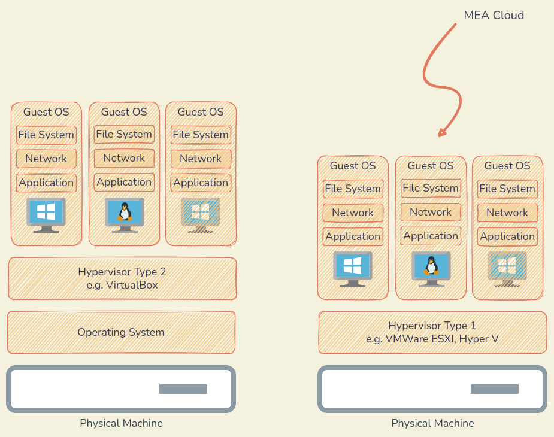
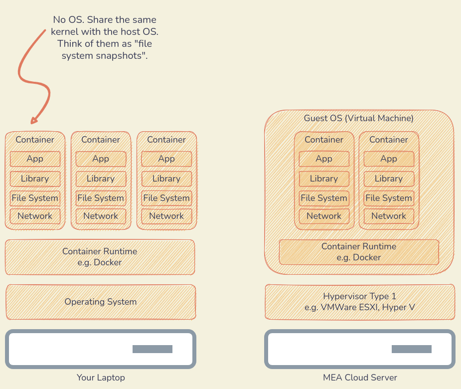

# Basics

## Prerequisites

- Basic Networking
- Basic Command Line
- Basic Programming & Software Development Process

## Containers vs Virtualization

### Virtualization



### Containerization



## Running Containers

คำสั่งการใช้งาน Docker มีรูปแบบ

```
docker <command> <sub-command> [options]
```

### Starting Containers

```
docker container run --name mywebserver --detach --publish 8080:80 nginx
```

สิ่งที่เกิดขึ้นหลังป้อนคำสั่ง

- Docker ไปค้นหา Image (นึกถึงโปรแกรมสำเร็จรูปที่แพกเกจเรียบร้อย มีไลบรารี่ครบถ้วน พร้อมใช้งาน) บนเครื่องคอมที่เราใช้งาน
- ถ้าไม่เจอ Image Docker มันจะไปค้นหาที่ Docker Hub ซึ่งเป็น Repository กลางสำหรับเก็บ Image
- เมื่อพบ Image แล้ว Docker จะ Download มาเก็บที่เครื่องคอมเรา
- Docker Engine เอา Image มาทำงาน ผลลัพธ์ของการรัน Image คือ Container
- `--name` คือการตั้งชื่อ Container ถ้าไม่ได้ตั้ง Docker จะให้ ID มาแทน
- `-d หรือ --detach` คือให้คืน Prompt ไม่ต้องแสดง Logs ตอนรัน
- `-p หรือ --publish` คือการบอกให้ Docker Engine เชื่อมต่อ Host Port 8080 กับ Container Port 80
- เข้า Web Browser ที่ [http://localhost:8080](http://localhost:8080) เพื่อดู Nginx Welcome Page

### Managing Containers

การบริหารจัดการ Container ใช้กลุ่มคำสั่ง `container` เช่น

```bash
docker container <sub-command>
```

### List Containers

ดูเฉพาะ Container ที่ทำงานอยู่

```bash
docker container ls
```

ดู Container ทั้งหมด (ทำงาน และ หยุดทำงาน)

```bash
docker container ls -a
```

### Stop Containers

```bash
docker container stop mywebserver
```

### Remove Containers

```bash
docker container rm mywebserver
```

### Container Logs

```bash
docker container logs mywebserver
```

### Container Ports

```bash
docker container port mywebserver
```

### Container Processes

```bash
docker container top mywebserver
```

### Resource Consumption

```bash
docker container stats mywebserver
```

### Inspect Containers

```bash
docker container inspect mywebserver
```

ตรวจสอบ IP Address ด้วยคำสั่ง

```bash
docker container inspect \
    --format '{{ .NetworkSettings.IPAddress }}' \
    mywebserver
```

`'{{ .NetworkSettings.IPAddress }}'` คือ Go Template

### Access Containers

```bash
docker container exec -it mywebserver bash
```

- `exec` คือคำสั่งให้รันโปรแกรมใน Container
- `-it` คือ `interactive tty` นึกถึงการเข้าใช้งาน Shell
- `bash` คือ ชื่อโปรแกรมที่ต้องการรันใน Container

### Clean up

ลบทุกสิ่งอย่าง (ยกเว้น Volume)

```bash
docker system prune -a
```

## Example 1 - PostgreSQL

### Starting a Database

```bash
docker container run \
    --name mypostgres \
    -e POSTGRES_PASSWORD=secretpassword \
    -d -p 5432:5432 \
    postgres
```

`-e หรือ --env` คือ Environment Variables ที่ต้องใช้งานใน Container

### Accessing psql

```bash
docker container exec -it mypostgres psql -U postgres
```

คำสั่งพื้นฐาน `psql`

1. `\l` หรือ `\l+` แสดงรายการ Database
2. `SELECT datname FROM pg_database;`
3. `\dt` หรือ `\dt *` แสดงรายการ Relations (Tables)
4. `CREATE DATABASE airflow;` สร้าง Database ชื่อว่า Airflow
5. ใช้คำสั่ง SQL ในการสร้างและทำงานกับข้อมูลได้เลย (จะใช้ CRUD กันจริงจังอีกที Session อื่น)

### Connecting from Host

ใช้โปรแกรมบริหารจัดการ Database (เช่น dbeaver หรือ beekeeper-studio) ในการเชื่อมต่อ PostgreSQL โดยกำหนด

- Host = `localhost`, Port = `5432`
- Username = `postgres`, Password = `secretpassword`


### Stopping the Database

```bash
docker container stop mypostgres
```

### Removing the Database

```bash
docker container rm mypostgres
```

## Example 2 - Web Server

### Starting a Web Server

```bash
docker container run --name mywebserver -d -p 8080:80 nginx
```

### Checking Container

เปิดเว็บ Browser [http://localhost:8080](http://localhost:8080)

### Changing Default Page

```bash
docker container exec -it mywebserver bash
```

1. ติดตั้ง Text Editor `vim` ด้วยคำสั่ง `apt update && apt install vim -y`
2. แก้ไขไฟล์ html `vim /usr/share/nginx/html/index.html`
3. กด Refresh ที่ Browserเพื่อตรวจสอบการแก้ไข

### Removing the Web Server

```bash
docker container rm -f mywebserver
```

`-f` คือ force บังคับ Remove โดยไม่ต้อง Stop ก่อน
