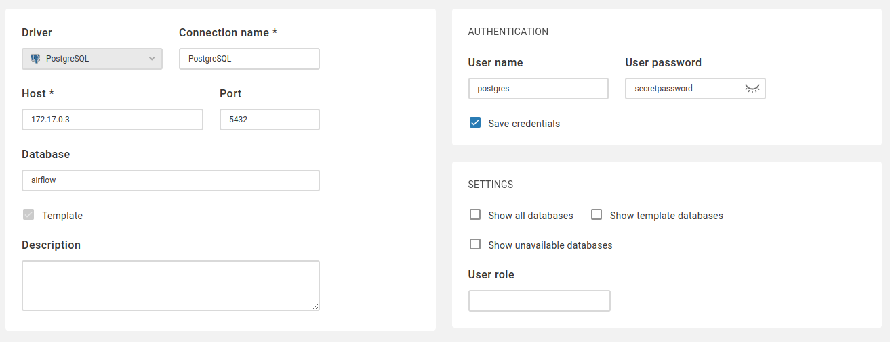

# Volumes

Volumes คือ File System ที่ Docker ใช้เก็บข้อมูลสำหรับ Container เช่น เก็บข้อมูลจาก Database

## Adding volumes to database

```bash
docker container run \
    --name mypostgres \
    -d -p 5432:5432 \
    -e POSTGRES_PASSWORD=secretpassword \
    -v postgresdb:/var/lib/postgresql/data \
    postgres
```

จุดสำคัญ

- `-v` คือการระบุ Volume ที่ต้องการใช้งานกับ Database PostgreSQL `postgresdb` เป็นชื่อ Docker Volume ที่ตั้งเองได้เลย `/var/lib/postgresql/data` คือ Path ที่ Database เขียนข้อมูลลงไป การระบุ `-v postgresdb:/var/lib/postgresql/data` หมายถึง ข้อมูลที่ Database เขียนลง `/var/lib/postgresql/data` จะถูกเก็บไว้บน Host ภายใต้ Volume ที่ชื่อ `postgresdb`
- การบริหารจัดการ Volumes ใช้กลุ่มคำสั่ง `volume` เช่น

```bash
docker volume <sub-command> [options]
```

## List Volumes

```bash
docker volume ls
```

## Inspect Volumes

```bash
docker volume inspect postgresdb
```

หรือ ตรวจสอบจาก Container ก็ได้

```bash
docker container inspect --format '{{ index .HostConfig.Binds 0 }}' mypostgres
```

## Example 1 - Persisting Data

### Create a Database Container

```bash
docker container run \
    --name mypostgres \
    -d -p 5432:5432 \
    -e POSTGRES_PASSWORD=secretpassword \
    -v postgresdb:/var/lib/postgresql/data \
    postgres
```

ตรวจสอบ Logs การ Init Database ด้วย

```bash
docker container logs mypostgres
```

### Create a Database 'airflow`

```bash
docker container exec -it mypostgres psql -U postgres
```

จากนั้นใส่คำสั่ง

```sql
CREATE DATABASE airflow;
```

เปลี่ยน Database มาเป็น `airflow`:

```bash
\c airflow;
```

สร้างตาราง

```sql
CREATE TABLE test(
  id SERIAL NOT NULL PRIMARY KEY,
  customer_name VARCHAR
);
```

ทดลองใส่ข้อมูล

```sql
INSERT INTO test(customer_name)
VALUES ('Jonathan Montgomery');
```

ทดลองเรียกข้อมูล

```sql
SELECT * FROM test;
```

### Removing PostgreSQL

ทดสอบทำลาย Container แล้ว สร้างขึ้นมาใหม่เพื่อดูว่าข้อมูลยังอยู่ไหม

```bash
docker container rm -f mypostgres
```

### Recreating PostgreSQL

สร้าง Container ขึ้นมาใหม่โดยใช้ Volume ชื่อเดิม และ ทดสอบ Query ว่าข้อมูลเดิมยังอยู่ไหม

```bash
docker container run \
    --name mypostgres \
    -d -p 5432:5432 \
    -e POSTGRES_PASSWORD=secretpassword \
    -v postgresdb:/var/lib/postgresql/data \
    postgres
```

ตรวจสอบ Logs จะพบว่าไม่มีการ Init Database แล้ว Container สามารถอ่าน Data จาก Volume ได้เลย

```bash
docker container logs mypostgres
```

## Example 2 - Using Data

ตรวจสอบว่า `mypostgres` ทำงานอยู่ด้วยคำสั่ง `docker container ls`

### Creating Management UI

```bash
docker run \
    --name cloudbeaver \
    --rm -it -p 8090:8978 \
    dbeaver/cloudbeaver:latest
```

`--rm` คือให้ลบ Container ออกหลังจากทำงานเสร็จแล้ว

### Accessing Data

เข้าเว็บที่ [http://localhost:8090](http://localhost:8090) กรอกข้อมูล Setup เช่น Admin Username & Password จากนั้น ตั้งค่า PostgresDB Connection ตัวอย่างตามรูป สาเหตุที่ต้องกรอกเป็น IP เพราะว่า Default Bridge Network ของ Docker ไม่มี DNS



กดปุ่ม Test Connection และ Save จากนั้นทดลองใช้งานว่ามีข้อมูลที่เราสร้างไว้ก่อนหน้านี้หรือไม่

## Bind Mounts

Bind Mounts คือการ Map local files หรือ folders สำหรับไปใช้งานบน Container มีประโยชน์ในกรณี

- พัฒนาซอฟต์แวร์ โดยให้ Source Code อยู่บนเครื่องเราแต่ให้สิทธิ Container อ่าน
- ตั้งค่าพารามิเตอร์ของ Container ผ่าน File

Bind Mounts ใช้ Flag `-v` เหมือนกัน

## Example 3 - Nginx Bind Mounts

ทำการ Bind Mount Folder ไฟล์ HTML เพื่อให้ Container NGINX นำไปแสดงผล

## Bind Mounting NGINX

เริ่มต้นด้วยการสร้าง Folder `nginx-bind` และ `cd nginx-bind` จากนั้นรันคำสั่ง

```bash
docker container run \
    --name=mywebserver \
    -d -p 8080:80 \
    -v $(pwd):/usr/share/nginx/html \
    nginx
```

`$(pwd)` คือ Print Working Directory

## Modifying HTML

ทดลองแก้ไขไฟล์ HTML เซฟ และ ทดสอบ Refresh ที่ Browser
