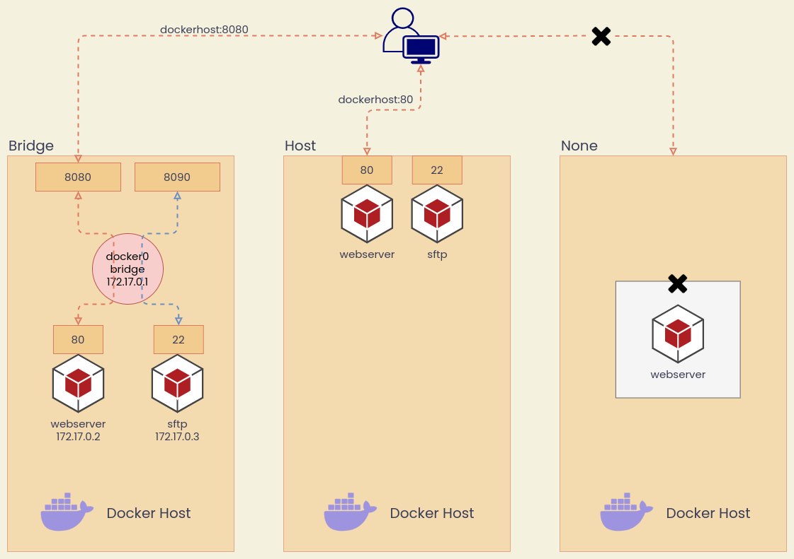
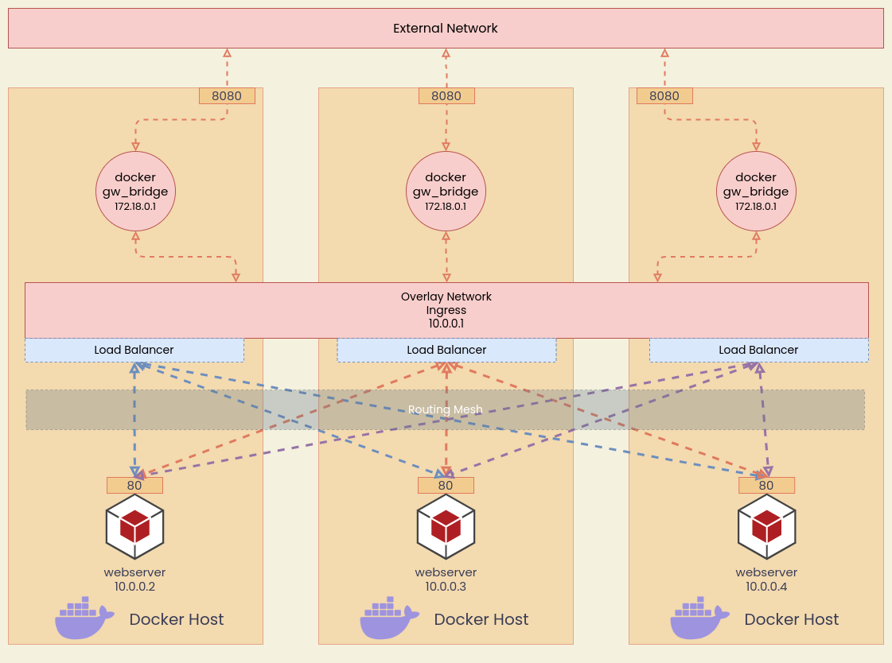

# Docker Networks

## Basic Networks

หลังจากติดตั้ง Docker บนเครื่องแล้ว จะมี Networks อยู่ 3 แบบ

- **Bridge** ทำงานเหมือน NAT (Network Address Translation)
- **Host** ใช้ IP/Port ร่วมกับ Host
- **None** ไม่เชื่อมต่ออะไรเลย มีแค่ Loopback Address เท่านั้น

นอกจากนี้ Docker (บน Linux เท่านั้น) ยังสนับสนุน Network **MACVLAN** กับ **IPVLAN** ในการให้ Container ใช้ IP Address Space เดียวกับ External Network ซึ่งจะไม่อธิบายวิธีการใช้งาน เนื่องจาก Use Case ของเราไม่น่าจะได้ใช้ สำหรับในกรณีที่ใช้งาน Docker Swarm เราจะใช้ **Overlay Network** ในการคุยข้าม Docker Host



## Bridge Networks

จุดสำคัญของ Bridge Networks

- **Default Bridge Network** Containers สื่อสารกันด้วย IP Address เท่านั้น ไม่สามารถใช้ชื่อ หรือ DNS Resolution ได้
- **Default Bridge Network** เริ่มต้นที่วง IP 172.17.0.0/16 ซึ่งชนกับ IP Address Space ของ Private Cloud กฟน. จำเป็นต้องแก้ไขหากติดตั้ง Docker บน VM
- **User Defined Bridge Network** สามารถใช้ DNS Resolution ได้ หมายถึง สามารถใช้ชื่อ Container แทน IP Address ได้

### Inspect Bridge Network

```bash
docker network inspect <network_name>
```

### Create Bridge Network

```bash
docker network create <network_name>
```

### Remove Bridge Network

```bash
docker network rm <network_name>
```

### Connect Containers to Bridge

```bash
docker container run --network <network_name> ...
```

## Host Network

Host Network คือ ระบบสื่อสารที่ Container ใช้ IP และ Port ของเครื่อง Docker Host เลย

### Connect Containers to Host

วิธีการ Run Container ไม่จำเป็นต้องระบุ `--publish` หรือ `-p` เช่น

```bash
docker container run -d --network host nginx
```

สามารถเข้าเว็บได้ที่ `localhost:80` หรือ `ip_address_docker_host:80` ได้เลย

## None Network

Container ไม่เชื่อมต่อกับ External Network และ ไม่สามารถคุยกับ Container อื่นได้

### Connect Containers to None

```bash
docker container run -d --network none nginx
```

## Overlay

เป็นระบบสื่อสารที่ Container ใช้คุยกันข้าม Docker Hosts จะใช้ Overlay Network ตอนทำงานกับ Container Orchestration ด้วย Docker Swarm
โดยปกติเราจะเลือกใช้ Kubernetes เป็นส่วนใหญ่ แต่ในบางกรณี Docker Swarm มันใช้ง่ายกว่าและติดตั้งภายใต้ Infrastructure ภายในเร็วกว่า

**ข้อจำกัดของ Swarm Mode** รายละเอียดอ่านที่ [Github](https://github.com/moby/moby/issues/30820)

- สร้าง Overlay Network โดยใช้ Subnet `/24` (Default) หากต้องการ IP Addresses มากกว่า 256 Addresses ให้สร้าง Overlay Network ย่อยๆ แทนการขยาย Subnet



### Creating an Overlay Network

```bash
docker network create -d overlay <network_name>
```
