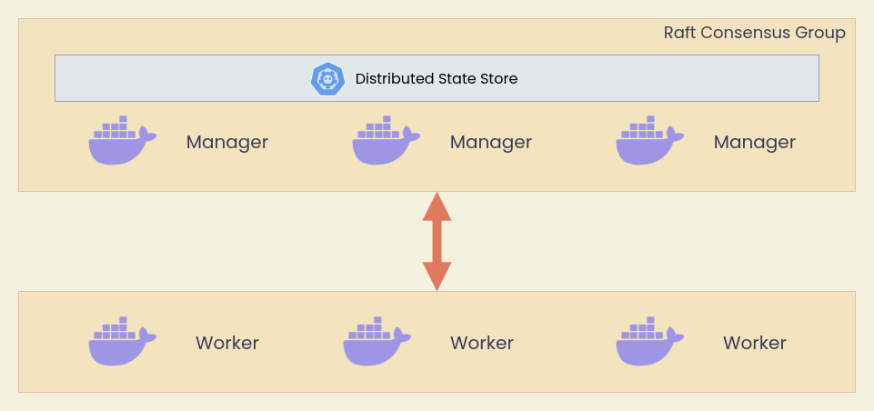

# Docker Swarm

Built in container orchestration

- `docker compose` ทำงานบน Server เครื่องเดียว
- `docker swarm` ทำงานเป็น Cluster (Server หลายเครื่อง) ผ่าน Overlay Network

## Swarm Architecture



อ่านเพิ่มเติม

- [Raft Consensus Algorithm](http://thesecretlivesofdata.com/raft/)
- [Differences between Services & Containers](https://stackoverflow.com/questions/43408493/what-is-the-difference-between-docker-service-and-docker-container#:~:text=docker%20service%20create%20is%20used,a%20template%20when%20instantiating%20tasks.)

## Swarm Init

เริ่มใช้งาน Docker Swarm ได้ด้วยคำสั่ง

```bash
docker swarm init
```

จะเห็น Output

```text
Swarm initialized: current node (w5rj9pqmcv0z2b052f8dr0qd2) is now a manager.

To add a worker to this swarm, run the following command:

    docker swarm join --token SWMTKN-1-6aq8xeo72o9kj5orlbzglt66fpxtw1dlmkb9djkgsatmpw8ugi-2jgc0rqmq2b5aet51dl89qbbz 192.168.1.77:2377

To add a manager to this swarm, run 'docker swarm join-token manager' and follow the instructions.
```

สิ่งสำคัญคือ

- `docker swarm init` คือการสร้าง Manager Node แรกของ Swarm
- เราสามารถใช้คำสั่งตาม Output เพื่อเพิ่ม Manager หรือเพิ่ม Worker ได้
- หลังจาก Init แล้วเราจะสามารถใช้คำสั่ง `docker service <sub-command>` ในการรัน Container

## Creating Manager Nodes

Copy คำสั่งที่คายออกมาจาก Swarm Initialization **ระวังเรื่อง IP Address เนื่องจากจะเปลี่ยนแปลงตามเครื่องที่เราทำการ Initialize Swarm**

หากใช้ [Play with Docker](https://labs.play-with-docker.com) ให้กดปุ่ม `ctrl + insert` เพื่อ Copy และ `shift + insert` เพื่อ Paste

```bash
docker swarm join --token SWMTKN-1-6aq8xeo72o9kj5orlbzglt66fpxtw1dlmkb9djkgsatmpw8ugi-2jgc0rqmq2b5aet51dl89qbbz 192.168.1.77:2377
```

## Creating Worker Nodes

พิมพ์คำสั่งที่เครื่อง Manager

```bash
docker swarm join-token manager
```

แล้ว Copy Output ไปใส่ในเครื่องที่ต้องการให้เป็น Manager Node

## Swarm Nodes

ตรวจสอบ Swarm Nodes ได้ด้วยคำสั่ง

```bash
docker node ls
```

## Deploy Services

ทดลอง Deploy Services Elastic Search v2

```bash
docker service create  --name=elastic  -p 9200:9200 elasticsearch:2
```

ทดลองเข้า Browser ที่ `docker_nodes_ip:9200` ใช้ IP ของ Manager หรือ Worker ก็ได้ ทดลอง Refresh หลายๆครั้งจะเห็นว่า Docker ทำ Load Balancing สำหรับ Service ใน Overlay Network ให้อัตโนมัติ

## Managing Services

### List Services

```bash
docker service ls
```

### List Logs

```bash
docker service logs elastic
```

### Scale Services

```bash
docker service scale elastic=3
```

### Remove Services

```bash
docker service rm elastic
```

## Docker Stacks

Stacks คล้ายๆกับ Compose แต่ทำงานอยู่บน Cluster แทนที่จะทำงานบนเครื่อง Server ตัวเดียว มองง่ายๆว่าเป็นกลุ่มของ Services **สามารถใช้ Compose File ในการ Deploy ได้** ตัวอย่างการ Deploy Docker Stack ของ Portainer

สร้างไฟล์ชื่อ `portainer-agent-stack.yml` และ Copy ด้านล่าง

```text
version: '3.7'

services:
  agent:
    image: portainer/agent:2.11.1
    volumes:
      - /var/run/docker.sock:/var/run/docker.sock
      - /var/lib/docker/volumes:/var/lib/docker/volumes
    networks:
      - agent_network
    deploy:
      mode: global
      placement:
        constraints: [node.platform.os == linux]

  portainer:
    image: portainer/portainer-ce:2.11.1
    command: -H tcp://tasks.agent:9001 --tlsskipverify
    ports:
      - "9443:9443"
      - "9000:9000"
      - "8000:8000"
    volumes:
      - portainer_data:/data
    networks:
      - agent_network
    deploy:
      mode: replicated
      replicas: 1
      placement:
        constraints: [node.role == manager]

networks:
  agent_network:
    driver: overlay
    attachable: true

volumes:
  portainer_data:

```

### Deploy a Stack

```bash
docker stack deploy -c portainer-agent-stack.yml portainer
```

### List Stacks

```bash
docker stack ls
```

### List Services in a Stack

```bash
docker stack services portainer
```

### Remove a Stack

```bash
docker stack rm portainer
```

จากนั้นทดลองใช้งานโดยการเข้าไปที่ `docker_nodes_ip:9000` เพื่อดู Portainer UI

ในงาน Data Engineering ของเราจะไม่ค่อยได้ใช้ Docker Swarm เราจะไปหนัก Kubernetes มากกว่า แต่ในกรณีที่ต้องการทดสอบ Technology ไวๆ ส่วนใหญ่จะวนๆแถว Docker ก่อนที่จะไปเท Infrastructure จริงบน Kubernetes
